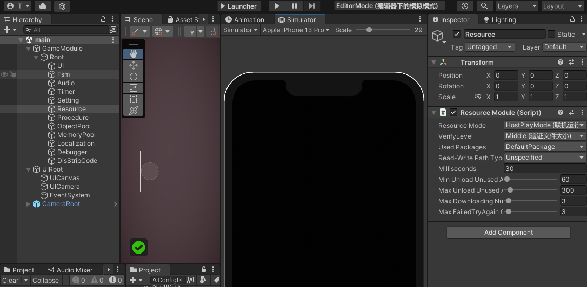

## 3-1.资源模块 - ResourceModule

#### 资源模块默认使用Addressable可寻址定位。(!注意需要打包的资源不可以重名)

资源模块运行模式有EditorSimulateMode、OfflinePlayMode以及HostPlayMode
编辑器模式下以顶部导航栏的选项卡为优先选项，打包后以Scene场景中ResourceModule脚本的Enum选项卡为优先选项(打包后不会走EditorSimulateMode)

Scene窗口Resource对象可以设置一些资源模块的常用设置，比如打包后的资源模式、资源校验等级以及自动卸载资源间隔等。


Menu窗口TEngineSetting可以设置一些资源模块的热更新设置，比如资源服务器地址以及在线参数等。备注在Luban目录下有一个基于Node的静态文件服务器，可以把在线参数以及AB放入用于做热更新测试。


## 重要拓展概念
* AssetReference (资源引用标识) 通用加载资源的时候绑定一个引用标识使你无需关心手动Dispose资源句柄。

* AssetGroup（资源组数据）进行资源分组绑定管理内存中的生命周期资源生命周期托管给资源组的根节点进行Dispose。

* LruCacheTable (Least Recently Used Cache缓存表)

* ArcCacheTable (Adaptive Replacement Cache缓存表)

## 加载资源示范
注意！资源模块默认使用Addressable可寻址定位。传入资源名字无需后缀即可！！
``` csharp

//同步加载。
GameModule.Resource.LoadAsset<SkillDisplayData>(location);

//异步加载。
GameModule.Resource.LoadAssetAsync<SkillDisplayData>(location, OnLoadSuccess);
private void OnLoadSuccess(AssetOperationHandle assetOperationHandle){}

//使用UniTask异步加载。
await GameModule.Resource.LoadAssetAsync<SkillDisplayData>(location,CancellationToken.None);
```

## 常用接口
remark：资源模块初始化的生命周期已经在流程模块实现了，具体有需求可以自定义开发。
``` csharp
/// <summary>
/// 获取当前资源包版本。
/// </summary>
/// <returns>资源包版本。</returns>
public string GetPackageVersion();

/// <summary>
/// 异步更新最新包的版本。
/// </summary>
/// <param name="appendTimeTicks">请求URL是否需要带时间戳。</param>
/// <param name="timeout">超时时间。</param>
/// <returns>请求远端包裹的最新版本操作句柄。</returns>
public UpdatePackageVersionOperation UpdatePackageVersionAsync(bool appendTimeTicks = false, int timeout = 60);

/// <summary>
/// 向网络端请求并更新清单
/// </summary>
/// <param name="packageVersion">更新的包裹版本</param>
/// <param name="autoSaveVersion">更新成功后自动保存版本号，作为下次初始化的版本。</param>
/// <param name="timeout">超时时间（默认值：60秒）</param>
public UpdatePackageManifestOperation UpdatePackageManifestAsync(string packageVersion, bool autoSaveVersion = true, int timeout = 60);

/// <summary>
/// 创建资源下载器，用于下载当前资源版本所有的资源包文件。
/// </summary>
public ResourceDownloaderOperation CreateResourceDownloader();


/// <summary>
/// 清理包裹未使用的缓存文件。
/// </summary>
public ClearUnusedCacheFilesOperation ClearUnusedCacheFilesAsync();


/// <summary>
/// 清理沙盒路径。
/// </summary>
public void ClearSandbox();

/// <summary>
/// 强制执行释放未被使用的资源。
/// </summary>
/// <param name="performGCCollect">是否使用垃圾回收。</param>
public void ForceUnloadUnusedAssets(bool performGCCollect);

/// <summary>
/// 检查资源是否存在。
/// </summary>
/// <param name="assetName">要检查资源的名称。</param>
/// <returns>检查资源是否存在的结果。</returns>
public HasAssetResult HasAsset(string assetName);

/// 同步加载资源。
/// </summary>
/// <param name="assetName">要加载资源的名称。</param>
/// <typeparam name="T">要加载资源的类型。</typeparam>
/// <returns>资源实例。</returns>
T LoadAsset<T>(string assetName) where T : Object;

/// <summary>
/// 同步加载资源。
/// </summary>
/// <param name="assetName">要加载资源的名称。</param>
/// <param name="parent">父节点位置。</param>
/// <typeparam name="T">要加载资源的类型。</typeparam>
/// <returns>资源实例。</returns>
T LoadAsset<T>(string assetName, Transform parent) where T :Object;

/// <summary>
/// 同步加载资源。
/// </summary>
/// <param name="handle">资源操作句柄。</param>
/// <param name="assetName">要加载资源的名称。</param>
/// <typeparam name="T">要加载资源的类型。</typeparam>
/// <returns>资源实例。</returns>
T LoadAsset<T>(string assetName,out AssetOperationHandle handle) where T : Object;

/// <summary>
/// 同步加载资源。
/// </summary>
/// <param name="assetName">要加载资源的名称。</param>
/// <param name="handle">资源操作句柄。</param>
/// <param name="parent">父节点位置。</param>
/// <typeparam name="T">要加载资源的类型。</typeparam>
/// <returns>资源实例。</returns>
T LoadAsset<T>(string assetName, Transform parent,out AssetOperationHandle handle) where T :Object;

/// <summary>
/// 异步加载资源。
/// </summary>
/// <param name="assetName">要加载资源的名称。</param>
/// <param name="cancellationToken">取消操作Token。</param>
/// <typeparam name="T">要加载资源的类型。</typeparam>
/// <returns>异步资源实例。</returns>
UniTask<T> LoadAssetAsync<T>(string assetName,CancellationToken cancellationToken) where T : Object;

/// <summary>
/// 异步加载游戏物体。
/// </summary>
/// <param name="assetName">要加载的游戏物体名称。</param>
/// <param name="cancellationToken">取消操作Token。</param>
/// <returns>异步游戏物体实例。</returns>
UniTask<UnityEngine.GameObject> LoadGameObjectAsync(string assetName,CancellationToken cancellationToken);

/// <summary>
/// 同步加载资源并获取句柄。
/// </summary>
/// <param name="assetName">要加载资源的名称。</param>
/// <typeparam name="T">要加载资源的类型。</typeparam>
/// <returns>同步加载资源句柄。</returns>
AssetOperationHandle LoadAssetGetOperation<T>(string assetName) where T : Object;

/// <summary>
/// 异步加载资源并获取句柄。
/// </summary>
/// <param name="assetName">要加载资源的名称。</param>
/// <typeparam name="T">要加载资源的类型。</typeparam>
/// <returns>异步加载资源句柄。</returns>
AssetOperationHandle LoadAssetAsyncHandle<T>(string assetName) where T : Object;

/// <summary>
/// 同步加载子资源对象
/// </summary>
/// <typeparam name="TObject">资源类型</typeparam>
/// <param name="location">资源的定位地址</param>
public SubAssetsOperationHandle LoadSubAssetsSync<TObject>(string location) where TObject : UnityEngine.Object;

/// <summary>
/// 异步加载子资源对象
/// </summary>
/// <typeparam name="TObject">资源类型</typeparam>
/// <param name="location">资源的定位地址</param>
public SubAssetsOperationHandle LoadSubAssetsAsync<TObject>(string location) where TObject : UnityEngine.Object;

/// <summary>
/// 同步加载子资源对象
/// </summary>
/// <param name="assetInfo">资源信息。</param>
public SubAssetsOperationHandle LoadSubAssetsSync(AssetInfo assetInfo);

/// <summary>
/// 异步加载场景。
/// </summary>
/// <param name="location">场景的定位地址</param>
/// <param name="sceneMode">场景加载模式</param>
/// <param name="activateOnLoad">加载完毕时是否主动激活</param>
/// <param name="priority">优先级</param>
/// <returns>异步加载场景句柄。</returns>
SceneOperationHandle LoadSceneAsync(string location, LoadSceneMode sceneMode = LoadSceneMode.Single, bool activateOnLoad = true, int priority = 100);

/// <summary>
/// 异步加载场景
/// </summary>
/// <param name="assetInfo">场景的资源信息</param>
/// <param name="sceneMode">场景加载模式</param>
/// <param name="activateOnLoad">加载完毕时是否主动激活</param>
/// <param name="priority">优先级</param>
/// <returns>异步加载场景句柄。</returns>
SceneOperationHandle LoadSceneAsync(AssetInfo assetInfo, LoadSceneMode sceneMode = LoadSceneMode.Single, bool activateOnLoad = true, int priority = 100);
```